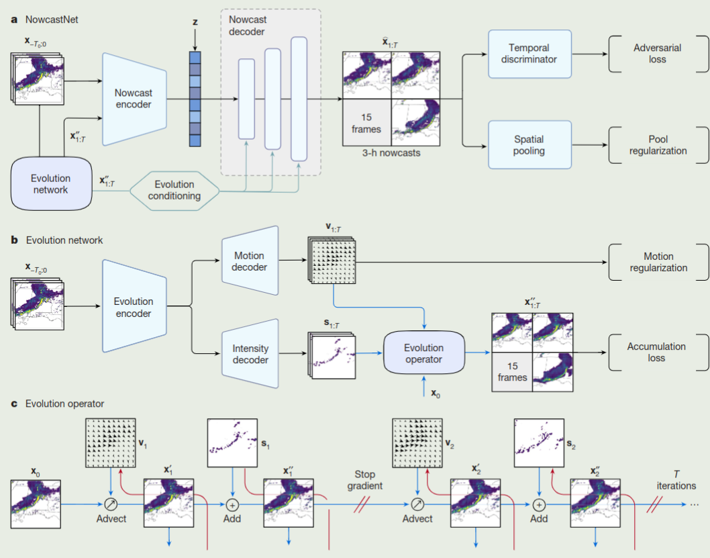
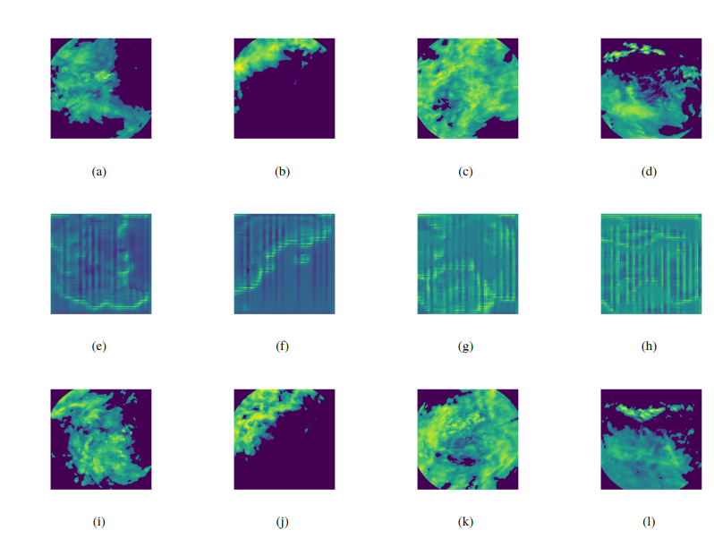
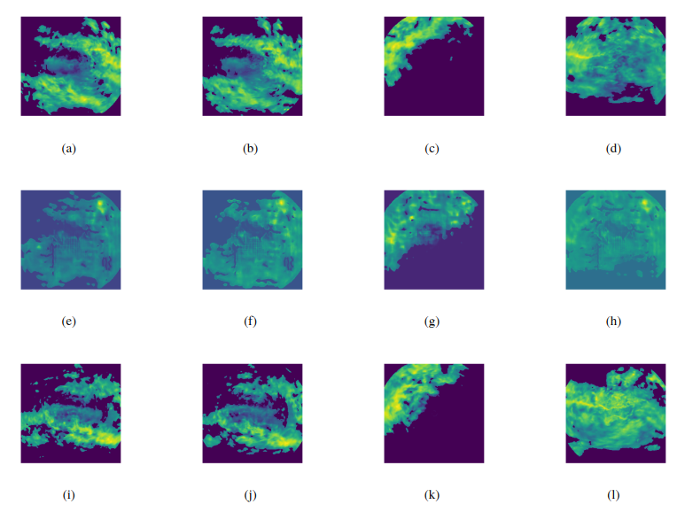
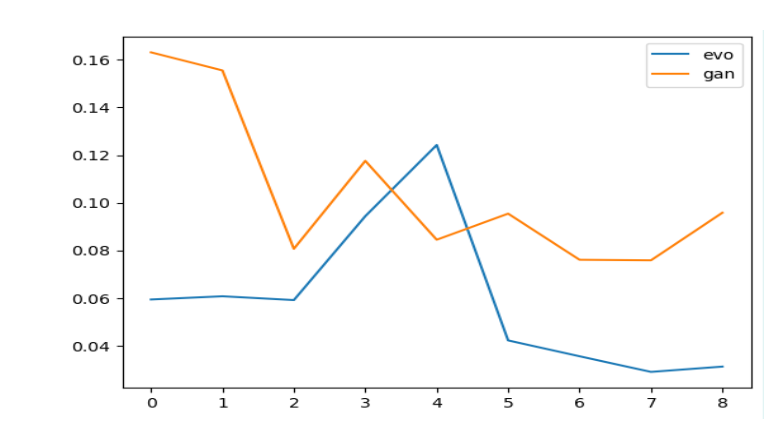

#! https://zhuanlan.zhihu.com/p/658871823
# 进化网络改进的对抗生成网络（GAN）实现  
## 声明  
本文主要参考《Skilful nowcasting of extreme precipitation with NowcastNet》(Nature, 5 July 2023)  
代码仓库:[GitHub](https://github.com/YunHao-Von/Evolution-GAN)  


## 1.任务说明
Gan网络是一种拟合已有数据分布同时强化对已有分布与拟合分布之间判别能力的技术，在各种生成图像的任务中应用广泛。但是传统的GAN比较难以进行训练，所以参考文献<sup><a href="#ref1">1</a></sup>提出了进化网络来改进生成网络的效果。  
根据笔者所进行的消融实验，在本文所应用的气候预测任务中，加入进化网络的对抗生成网络确实比起原生的GAN结构效果要好很多。同时引入了进化网络后，模型收敛速度显著加快，损失值降低，因此参考文献<sup><a href="#ref1">1</a></sup>中所提出的进化网络确实是一种卓尔有效的方法（不愧是Nature）。    

<figure class="third">
    
    
    
</figure>
如图所示，左图是原生的GAN 的预测结果，中间是引入了进化网络的GAN 的预测结果，最右图是实际的真实图像。 


实验结果请见后文。
本文所要面对的任务是一种端到端的图像预测，从该行业的业界实用来看，使用GAN网络结构进行预测确实是一种主流的趋势，因此本文也从众使用GAN网络来进行图像预测。  
模型任务:  
$$Inputs: X_{-T:0}，过去的-T（过去时间点）到0（当前时刻的图片。$$  
$$Outputs:\hat{X}_{1:T},未来T个时间段的图片。$$  


## 2.网络结构  
    

### 生成器
如图中a部分所示，为进化对抗生成网络(Nowcastnet)的主体结构。对比起常用的端到端的GAN网络（比如Cycle-GAN）来说，Nowcastnet的主体结构多出来一个Evolution network模块。  
该模块本质上仍然是一个生成网络，图片Evolution Encoder后经过Motion decoder和Intensity decoder可以捕捉输入数据中的额外物理信息，经过进化算子后生成$x''_{1:T}$返回给原始的生成网络。    
本质上讲，可以理解为Nowcast是一个嵌套的对抗生成网络，利用内层网络来捕捉输入数据中的物理信息，然后将捕捉到的物理信息与原始输入图片一起输入到外层生成网络中去。  
外层生成网络同时接受了$x和x''$两个输入，两个输入在经过encoder编码后又与随机向量Z进行混合，一起输入解码器。  
解码器的每层网络均值和方差又被进化网络的统计量加以取代。  

### 辨别器  
关于辨别器，本文在做实验的时候，曾经尝试过使用四层卷积神经网络和Resnet两种辨别器来进行实验。  
从实验结果来看，Resnet的本身结构更加复杂，并且拥有残差机制可以进一步保留输入中的信息。  
同时浅层网络容易在梯度更新中使得参数全部归0，出现梯度消失现象从而导致网络更新出现异常。  
因此本文推荐使用Resnet作为辨别器进行训练。  

### 损失函数  
关于损失函数，本文除了采用传统的的对抗损失之外，还使用了一个池化损失。对于池化损失，我理解为一种变相的均方误差，旨在通过该损失直接提升生成结果和实际结果之间的相似性。  


进化网络的代码如下:  
```
class Evolution_Network(nn.Module):
    def __init__(self, n_channels, n_classes, base_c=64, bilinear=True):
        super(Evolution_Network, self).__init__()
        self.n_channels = n_channels
        self.n_classes = n_classes
        self.bilinear = bilinear
        base_c = base_c
        self.inc = DoubleConv(n_channels, base_c)
        self.down1 = Down(base_c * 1, base_c * 2)
        self.down2 = Down(base_c * 2, base_c * 4)
        self.down3 = Down(base_c * 4, base_c * 8)
        factor = 2 if bilinear else 1
        self.down4 = Down(base_c * 8, base_c * 16 // factor)

        self.up1 = Up(base_c * 16, base_c * 8 // factor, bilinear)
        self.up2 = Up(base_c * 8, base_c * 4 // factor, bilinear)
        self.up3 = Up(base_c * 4, base_c * 2 // factor, bilinear)
        self.up4 = Up(base_c * 2, base_c * 1, bilinear)
        self.outc = OutConv(base_c * 1, n_classes)
        self.gamma = nn.Parameter(torch.zeros(1, n_classes, 1, 1), requires_grad=True)

        self.up1_v = Up(base_c * 16, base_c * 8 // factor, bilinear)
        self.up2_v = Up(base_c * 8, base_c * 4 // factor, bilinear)
        self.up3_v = Up(base_c * 4, base_c * 2 // factor, bilinear)
        self.up4_v = Up(base_c * 2, base_c * 1, bilinear)
        self.outc_v = OutConv(base_c * 1, n_classes * 2)

    def forward(self, x):
        x1 = self.inc(x)
        x2 = self.down1(x1)
        x3 = self.down2(x2)
        x4 = self.down3(x3)
        x5 = self.down4(x4)
        x = self.up1(x5, x4)
        x = self.up2(x, x3)
        x = self.up3(x, x2)
        x = self.up4(x, x1)
        x = self.outc(x) * self.gamma

        v = self.up1_v(x5, x4)
        v = self.up2_v(v, x3)
        v = self.up3_v(v, x2)
        v = self.up4_v(v, x1)
        v = self.outc_v(v)
        return x, v
```   

### 训练过程  
请注意detach()函数的使用，同时本文设定了梯度递减。  
```
for epoch in range(n_epochs):
    for batch_id, (x_data,y_data) in enumerate(data_loader):
        x_data = x_data.numpy()
        y_data = y_data.numpy()
        x_data = torch.FloatTensor(x_data).to(configs['device'])
        y_data = torch.FloatTensor(y_data).to(configs['device'])
        real_label = torch.ones(10*args['batch_size'],1).cuda()
        real_out = discriminator(y_data[...,:1])
        loss_real_D = criterion(real_out,real_label)
        optimizer_D.zero_grad()
        loss_real_D.backward()
        optimizer_D.step()
        loss_real_D_list.append(loss_real_D)
        
        

        
        fake_label = torch.zeros(10*args['batch_size'],1).cuda()
        frames_tensor = x_data.cpu()
        frames_tensor = torch.FloatTensor(frames_tensor).to(configs['device'])
        fake_img = generator(frames_tensor).detach()
        fake_out = discriminator(fake_img)
        loss_fake_D = criterion(fake_out,fake_label)
        optimizer_D.zero_grad()
        loss_fake_D.backward()
        optimizer_D.step()
        loss_fake_D_list.append(loss_fake_D)
        
        
        genera_x = x_data.cpu()
        genera_x = Variable(torch.FloatTensor(genera_x)).to(configs['device'])
        fake_img = generator(genera_x)
        output = discriminator(fake_img)
        loss_G = criterion(output, torch.ones_like(output))
        loss_p = maxpool_loss(y_data[...,:1],fake_img)
        
        loss_G = loss_G*6 + loss_p*20
        optimizer_G.zero_grad()
        loss_G.backward()
        optimizer_G.step()
        if batch_id % 10 == 0:
            with open('output.output','a') as file:
                print("Epoch:{},Batch:{}".format(epoch,batch_id),file=file)
                print("loss_real_D:{},loss_fake_D:{},loss_P:{},loss_G:{}".format(loss_real_D.detach().cpu(),loss_fake_D.detach().cpu(),loss_p.detach().cpu(),loss_G.detach().cpu()),file=file)
                print("----------------------------------------",file=file)
        if batch_id % 80 == 0:
            genera_y = y_data.cpu()
            temp_plot = fake_img[0,0,:,:,0]
            save_plots(genera_x[0,0,:,:,0],epoch,batch_id,"X")
            save_plots(genera_y[0,0,:,:,0],epoch,batch_id,"Y")
            save_plots(temp_plot,epoch,batch_id,"Result")
    torch.save(generator, 'ModelSave/epoch_'+str(epoch)+'generator.pth')  
    torch.save(discriminator, 'ModelSave/epoch_'+str(epoch)+'discriminator.pth')
    scheduler_G.step()
    scheduler_D.step()
```

## 3.实验结果  
数据：基于南京大学气候雷达数据集。  
硬件：Nvidia Tesla V100 16GB。  
系统：Ubuntu22.04。  
代码仓库:[GitHub](https://github.com/YunHao-Von/Evolution-GAN)  
运行epoch：100. 

  
本图为原生的GAN结果图，第一排是原始的输入数据，第二排是原始GAN预测数据，第三派是真实结果。  
可见GAN应对于图像预测确实效力不足。  
  
本图为引入了进化网络的GAN结果图，第一排是原始的输入数据，第二排是Nowacat预测数据，第三派是真实结果。    
  
本图为带有进化网络的临近预报模型 (evo) 和原始临近预报模型的最大池化损失对比图。

综上所述，可见进化网络对于GAN的改进确实卓有成效。


## 4.参考

 1. <p name = "ref1">Zhang, Yuchen, et al. "Skilful nowcasting of extreme precipitation with NowcastNet." Nature (2023): 1-7.</p>